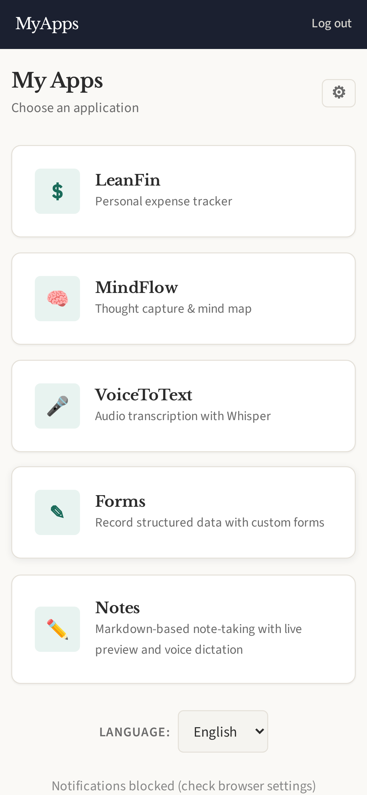
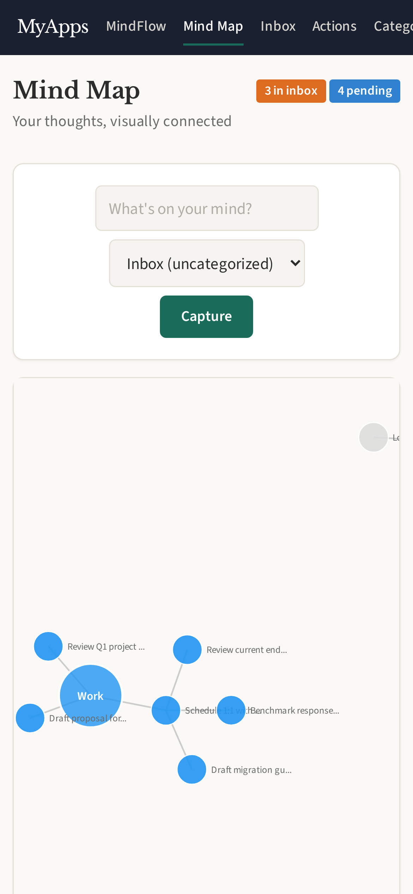
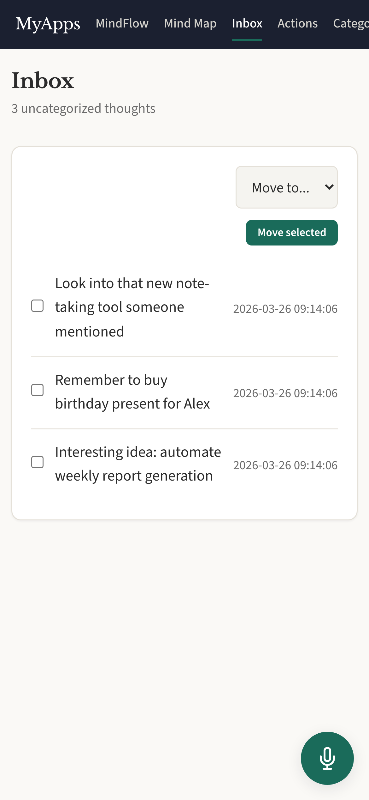
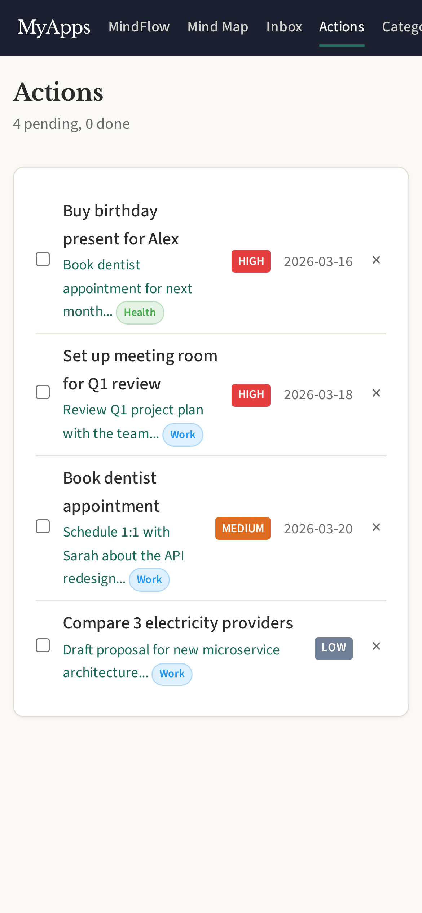
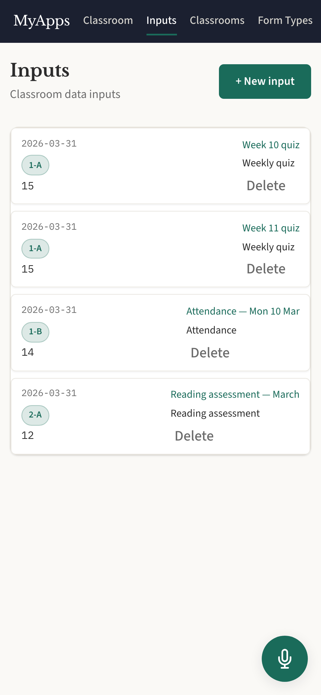
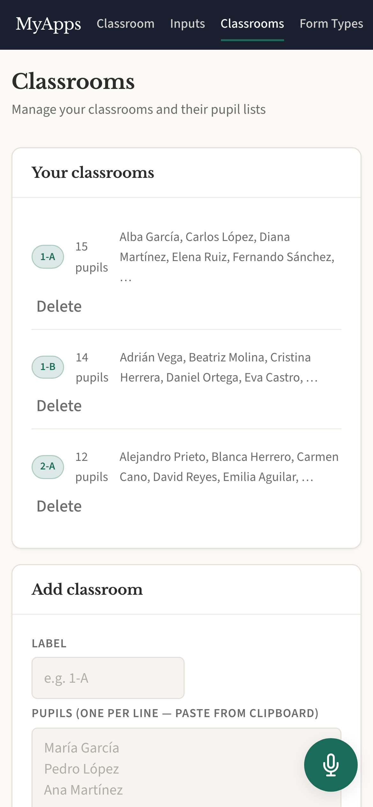

# MyApps

A self-hosted, multi-app personal platform built with **Rust**, **Axum**,
**HTMX**, and **SQLite**. It runs as a single binary on minimal hardware
(tested on an Odroid N2) and ships four purpose-built apps behind a shared
login and launcher.

> **This is a personal project.** Contributions are not accepted — feel free to
> fork it and make it your own.

---

## Apps

| App | Crate | What it does |
|-----|-------|-------------|
| **LeanFin** ($) | [`myapps-leanfin`](crates/myapps-leanfin/) | Personal expense management with bank sync (PSD2 via Enable Banking), manual accounts, labels, auto-labeling rules, balance evolution charts, and expense breakdowns. |
| **MindFlow** (🧠) | [`myapps-mindflow`](crates/myapps-mindflow/) | Thought capture and mind mapping. Quickly jot down ideas, organise them into categories, visualise connections on a D3-powered map, and turn thoughts into actions. |
| **VoiceToText** (🎤) | [`myapps-voice-to-text`](crates/myapps-voice-to-text/) | Audio transcription powered by whisper.cpp. Record or upload audio and get text back — all processed locally, no cloud APIs. |
| **ClassroomInput** (✎) | [`myapps-classroom-input`](crates/myapps-classroom-input/) | Classroom marks and notes recording. Define custom form types, manage classrooms and students, and record structured observations. |
| **Notes** (✏️) | [`myapps-notes`](crates/myapps-notes/) | Markdown-based note-taking with live WYSIWYG editing and voice dictation. |

All apps share authentication, database, layout/styling, i18n (EN/ES), and
push notifications.

### Launcher

After login you land on the app launcher, a grid of cards you can reorder and
hide per-user.

<p align="center">
  
</p>

### LeanFin

<p align="center">
  
  
  
</p>
<p align="center">
  
  
</p>

### MindFlow

<p align="center">
  
  
  
</p>

### VoiceToText

<p align="center">
  
</p>

### ClassroomInput

<p align="center">
  
  
</p>

---

## Tech stack

| Layer | Technology |
|-------|-----------|
| Language | Rust (Edition 2024) |
| Web framework | Axum |
| Frontend | HTMX + server-rendered HTML |
| Database | SQLite (sqlx, runtime-checked queries) |
| Auth | Argon2 + server-side sessions |
| Charts | Frappe Charts |
| Mind map | D3.js |
| Bank sync | Enable Banking PSD2 API |
| Speech-to-text | whisper.cpp (local) |
| LLM command bar | llama.cpp (local, optional) |
| Push notifications | Web Push (VAPID) |
| Deploy target | Any Linux box — tested on Odroid N2 (aarch64) |

---

## Getting started (fork & run)

### Prerequisites

- **Rust** (stable, 2024 edition)
- **SQLite 3**
- **Node.js** (only for regenerating screenshots)
- **whisper.cpp** binary on `$PATH` (for VoiceToText)
- **ffmpeg** (for audio conversion in VoiceToText)

### 1. Clone and configure

```bash
git clone https://github.com/<you>/myapps.git
cd myapps
cp .env.example .env
# Edit .env — at minimum set ENCRYPTION_KEY:
#   openssl rand -hex 32
```

### 2. Create a user

```bash
cargo run -- create-user --username yourname --password yourpassword
```

Or generate an invite link (48 h, single-use):

```bash
cargo run -- invite
```

### 3. Seed demo data (optional)

```bash
cargo run -- seed --user yourname
```

This populates LeanFin with sample transactions and accounts, MindFlow with
thoughts and categories, and ClassroomInput with classrooms and students.

### 4. Run

```bash
cargo run -- serve          # http://localhost:3000
```

### Choosing which apps to deploy

Set `DEPLOY_APPS` in `.env` to a comma-separated list of app keys to enable
only a subset:

```
DEPLOY_APPS=leanfin,mindflow
```

Leave it blank to deploy all apps.

---

## Useful commands

```bash
make check                  # fmt-check + clippy + test (same as CI)
make screenshots            # Regenerate README screenshots (needs Node.js)
cargo run -- cron           # Run scheduled tasks (e.g. bank sync)
cargo run -- delete-user --username <name>
cargo run -- delete-user-app-data --username <name> --app leanfin
cargo run -- cleanup-users --days 7
```

---

## Screenshots automation

The screenshots in this README are generated automatically by a Playwright
script, so they stay in sync with the actual UI.

```bash
make screenshots
```

This will:
1. Build the project in release mode
2. Create a temporary SQLite database with seeded demo data
3. Start a local server
4. Run Playwright (headless Chromium, iPhone 14 viewport) to capture every
   screen
5. Save PNGs to `docs/screenshots/` and clean up

You can re-run this any time after UI changes to keep the README up to date.

---

## Deployment

MyApps is designed to run on a single low-power server. See
[docs/deployment.md](docs/deployment.md) for full setup instructions covering
nginx, systemd, TLS, and the `deploy.sh` script.

---

## License

This is a personal project. No license is granted — fork and adapt as you see
fit for your own use.
