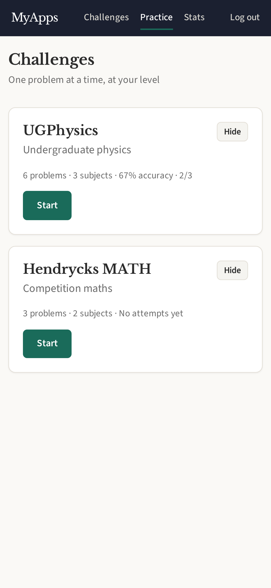
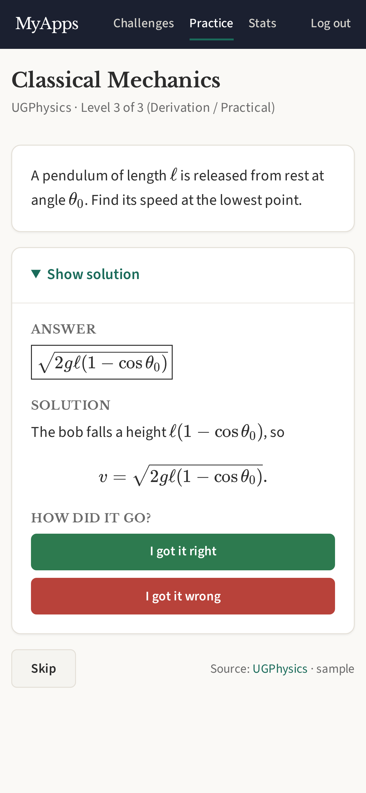
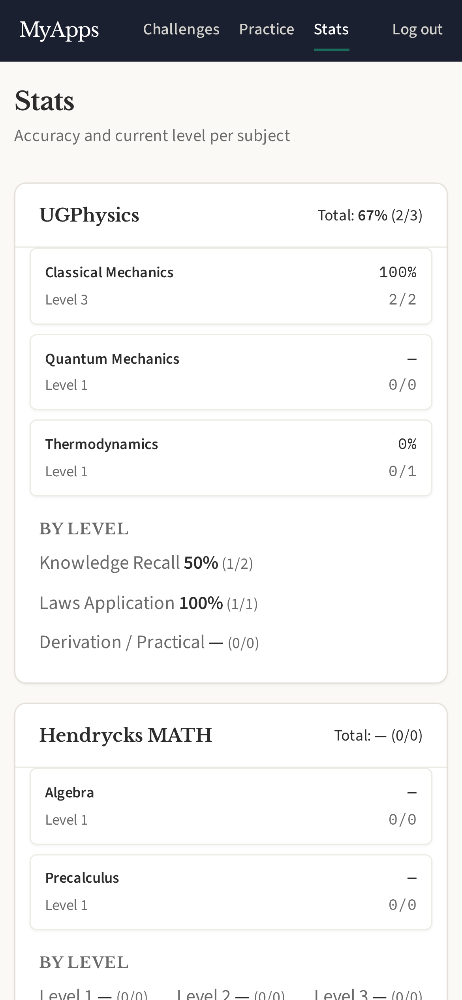

# Challenges

One undergraduate maths or physics problem at a time, at a level that follows
how you are doing. Read the problem, work it out, reveal the solution and mark
yourself right or wrong.

The design, and the research behind the dataset choice, is in
[docs/ideas-03-graded-math-physics.md](../../docs/ideas-03-graded-math-physics.md).

## Screenshots

<p align="center">
  
  
  
</p>

## Datasets

| Dataset | Problems | Levels | Licence |
|---|---|---|---|
| [UGPhysics](https://huggingface.co/datasets/UGPhysics/ugphysics) (English) | 5,314 in 13 subjects | 3, from its skill type: Knowledge Recall → Laws Application → Derivation / Practical | CC BY-NC-SA 4.0 |
| [Hendrycks MATH](https://huggingface.co/datasets/EleutherAI/hendrycks_math) | 11,372 in 7 subjects | 5, as published | MIT |

Neither ships in the binary or the repo. When `serve` starts, it imports every
dataset that has never finished importing, in the background (a few minutes
each). Completion is recorded in `challenges_imports`, so an interrupted import
resumes on the next start and a finished one is not repeated. A database the
seed filled with sample problems is left alone. To refresh by hand:

```sh
myapps import --app challenges --dataset ugphysics
myapps import --app challenges --dataset hendrycks-math
```

Left out at import: UGPhysics problems without a `level`; Hendrycks problems
tagged `Level ?` or drawn with Asymptote (`[asy]`), which a browser cannot
render. Re-running an import updates problems in place and keeps their ids.

## How the next problem is chosen

- The **subject** is uniformly random among the dataset's subjects.
- Your **level** is tracked per subject, starting at 1. Two right answers in a
  row move it up, one wrong moves it down. Until your first wrong answer in a
  subject, a single right answer moves it up, so the cold start is quick.
- The **target level** is drawn from L-1 / L / L+1 with weights 15 / 60 / 25.
- Problems you have **never attempted** come first, falling back to other
  levels by distance from yours; once a subject is exhausted, the problem seen
  longest ago comes back.

Once drawn, a problem stays yours until you mark it or skip it: each dataset
has one practice URL that always shows its problem in progress, across reloads
and server restarts. Marking and *Skip* swap the next problem into the page
rather than navigating, so the browser's back and forward buttons leave the
practice page instead of stepping through problems. *Skip* draws another
problem without recording anything. A subject with nothing left but the problem
you just finished hands over to another subject rather than repeating it.

## Features

- Dataset picker with problem counts and your overall accuracy; *Continue*
  when a problem is in progress; datasets you hide move to a list below it
- Practice page with the answer, the worked solution and the right/wrong
  buttons behind *Show solution*; LaTeX typeset by KaTeX
- A level-change notice above the next problem when an answer moves you up or down
- Stats: accuracy and current level per subject, and accuracy per level
- Command bar: `next_problem` (opens the problem in progress, optionally per
  dataset), `stats`
