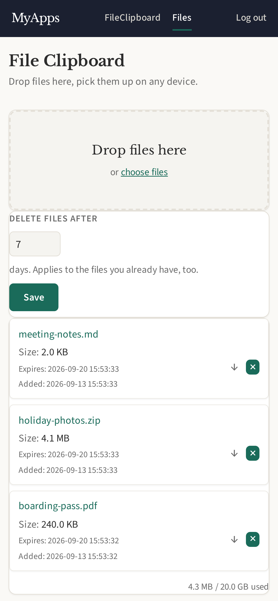

# FileClipboard

Drop files here, pick them up on any device.

  

## Features

- Drag-and-drop upload with per-file progress (large files stream to disk)
- List of stored files with size, upload date and expiry
- Configurable deletion period (default 7 days), applied to existing files too
- Automatic sweep of expired files and orphaned bytes

## Storage

File contents are **not** stored in SQLite — they live under
`FILE_CLIPBOARD_DIR/<user_id>/<uuid>`, with metadata in `file_clipboard_files`.
Uploads stream to a `.part` file, are fsynced, then atomically renamed, so a
metadata row never points at an incomplete file. See `src/storage.rs`.

Downloads are always served as `attachment` with `nosniff` and a neutral
content type: the bytes are user-supplied and served from the same origin as
the session cookie, so rendering them inline would be stored XSS.
