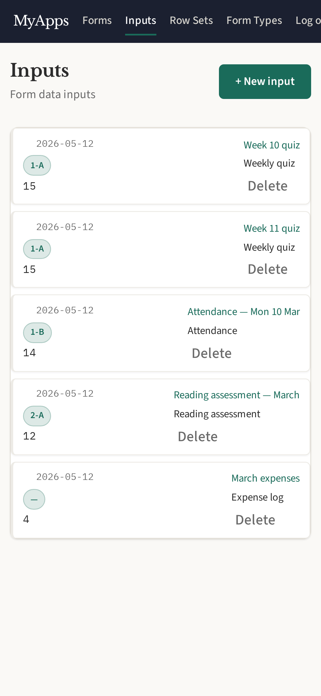
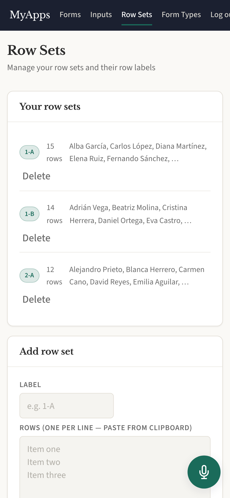
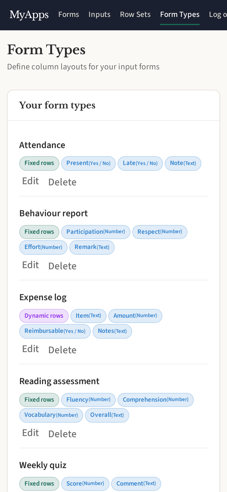

# FormInput

Record structured data with custom forms. Define custom form types,
manage row sets, and capture rows of data with a spreadsheet-style grid.

## Screenshots

  
  
  

## Features

- Define custom form types with configurable columns (text, number, yes/no, link)
- Toggle `fixed_rows` per form type — pin rows to a row set, or add rows freely
- Manage row sets (named lists of row identifiers)
- Capture inputs as CSV-backed grids; double-click any cell to edit in place
- Bulk-create inputs by uploading a CSV (column count is enforced against the
  form type; for fixed-row form types the first column is the row-set key)
- Per-column sort and filter on the view (presentation-only, the underlying
  CSV stays unsorted/unfiltered)
- Link cells: small modal for URL + display text, rendered as an anchor in
  the view
