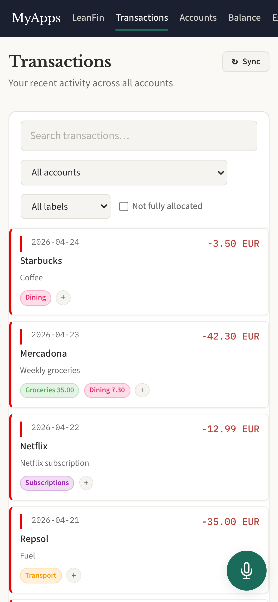
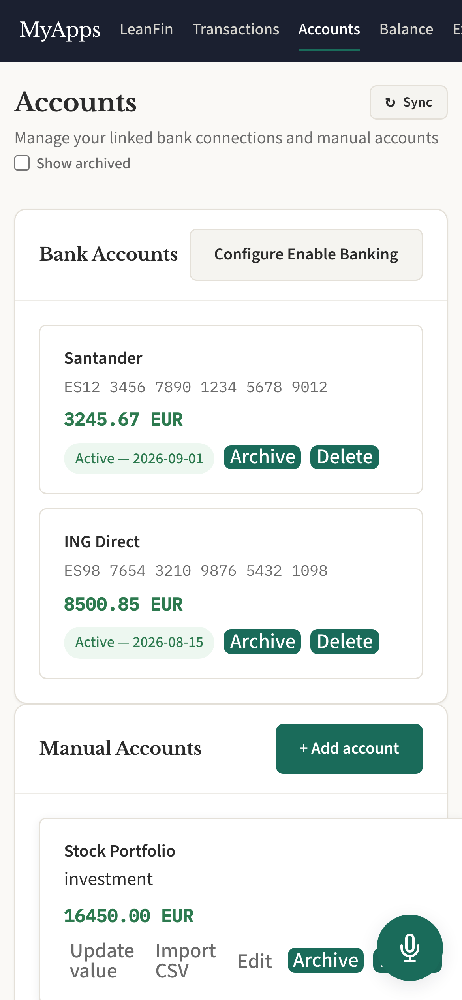
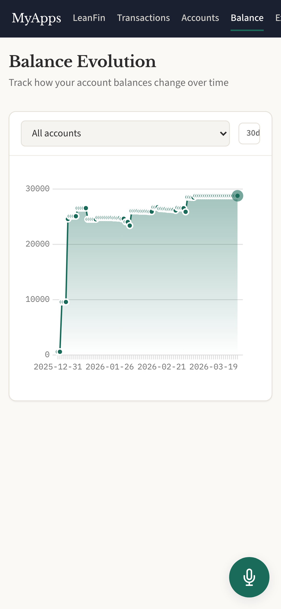
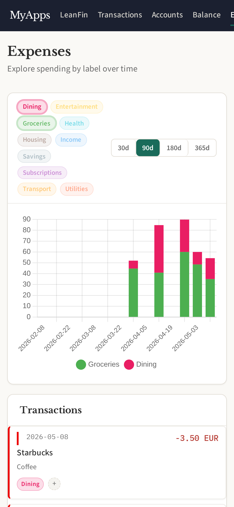
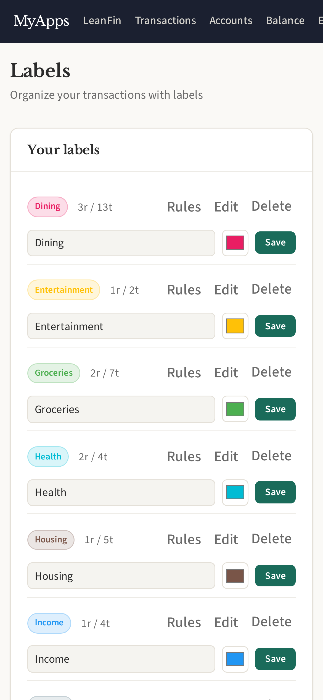
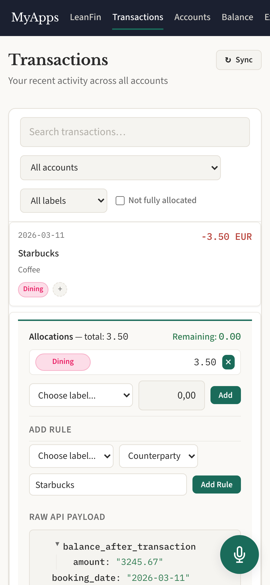

# LeanFin

Personal expense management with bank sync (PSD2 via Enable Banking), manual
accounts, labels, auto-labeling rules, balance evolution charts, and expense
breakdowns.

## Screenshots

  
  
  

  
  
  

## Features

- Bank account sync via PSD2 (Enable Banking API)
- Manual accounts for cash, crypto, and other assets
- Transaction labeling with automatic rules
- Balance evolution charts over time
- Expense breakdown by label
- CSV import for bank statements
- Per-user encrypted API credentials
