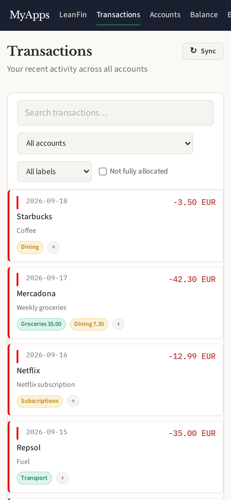
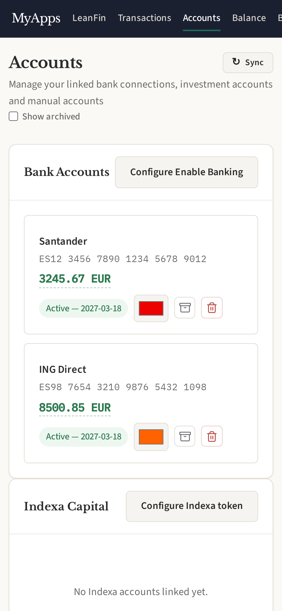
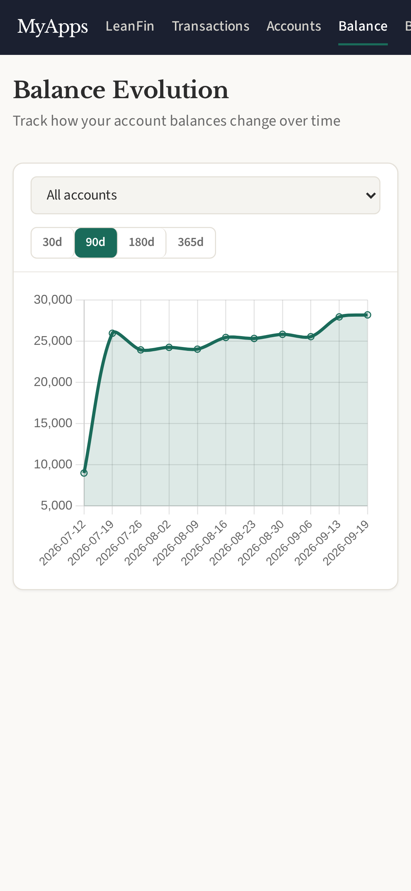
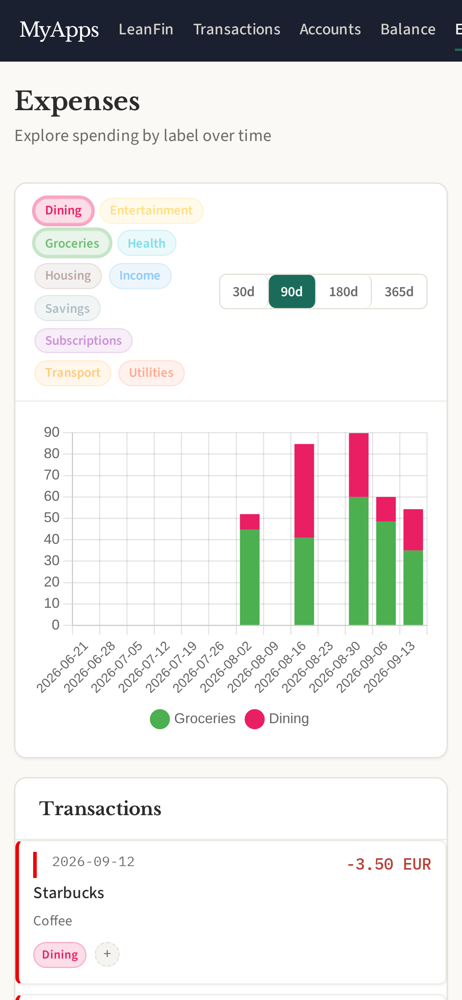
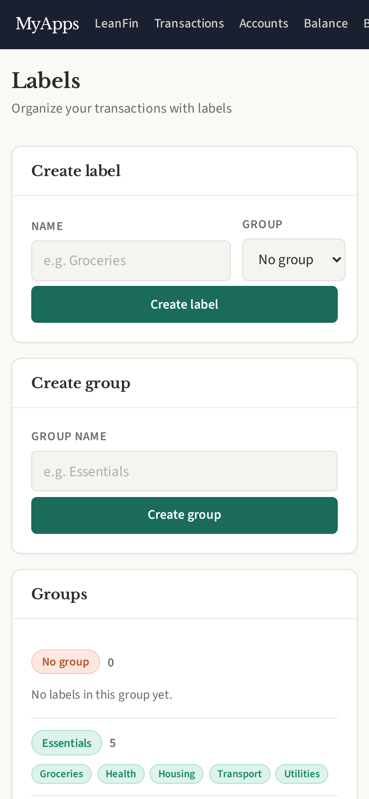
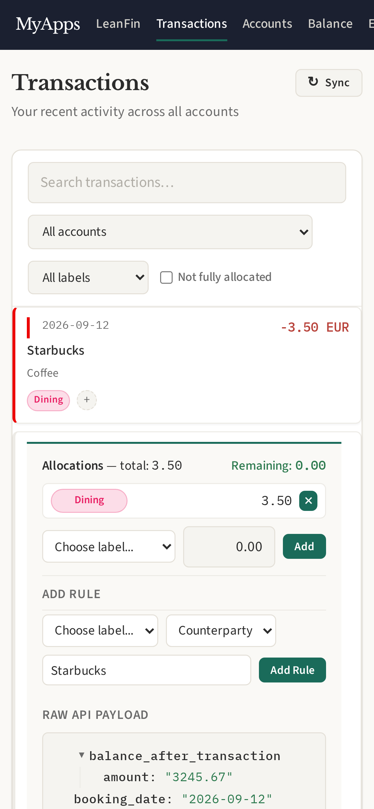

# LeanFin

Personal expense management with bank sync (PSD2 via Enable Banking), manual
accounts, labels grouped into colour-coded groups, rule-based label suggestions,
balance evolution charts, and spending breakdowns.

## Screenshots

  
  
  

  
  
  

## Features

- Bank account sync via PSD2 (Enable Banking API)
- Manual accounts for cash, crypto, and other assets
- Transaction labeling; rules pre-fill a label, which is written only when you
  press Done — a sync never allocates behind your back
- Labels belong to groups, and a group's colour is derived from its id, so it
  never drifts and is never picked by hand
- Balance evolution charts over time; clicking a point lists the transactions
  for the period it covers
- Spending breakdown for one group: a time series plus a per-label bar chart
- CSV import for bank statements
- Per-user encrypted API credentials
