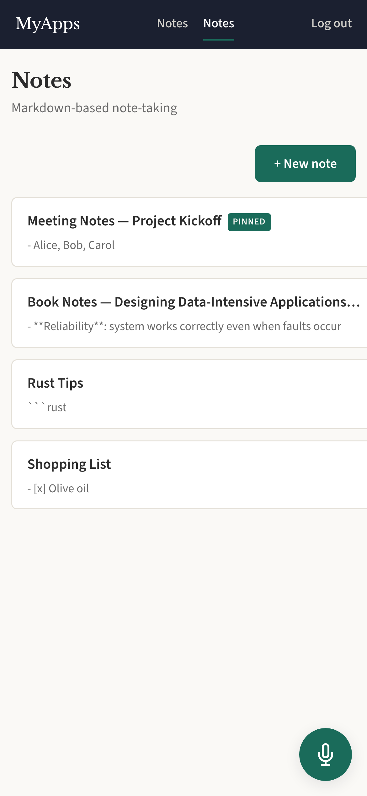
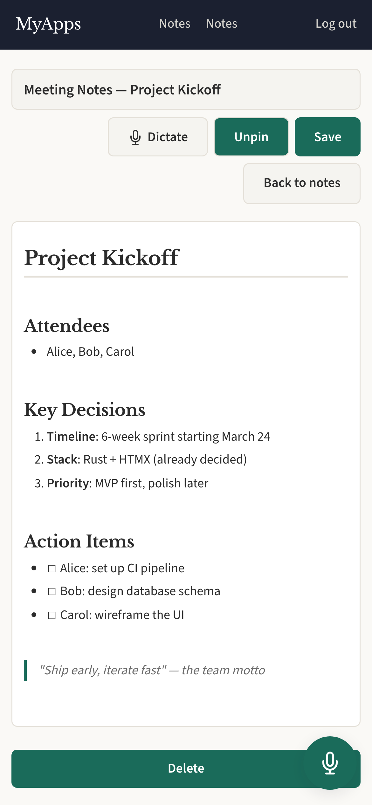

# Notes

Markdown-based note-taking with live preview and voice dictation.

  
  

## Features

- Live Markdown WYSIWYG editing (headings, code blocks, lists, etc.)
- Voice dictation via whisper.cpp
- Pin important notes
- Search notes
- Future: share notes with other users
