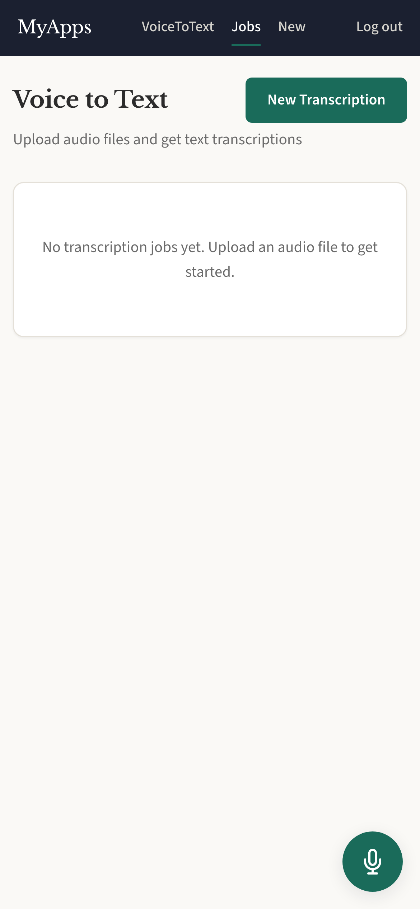

# VoiceToText

Audio transcription powered by whisper.cpp. Record or upload audio and get text
back — all processed locally, no cloud APIs.

## Screenshots

  

## Features

- Record audio directly from the browser
- Upload audio files for transcription
- Local processing via whisper.cpp (no cloud)
- Background job queue with status tracking
- Push notification on completion
